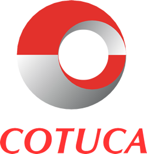
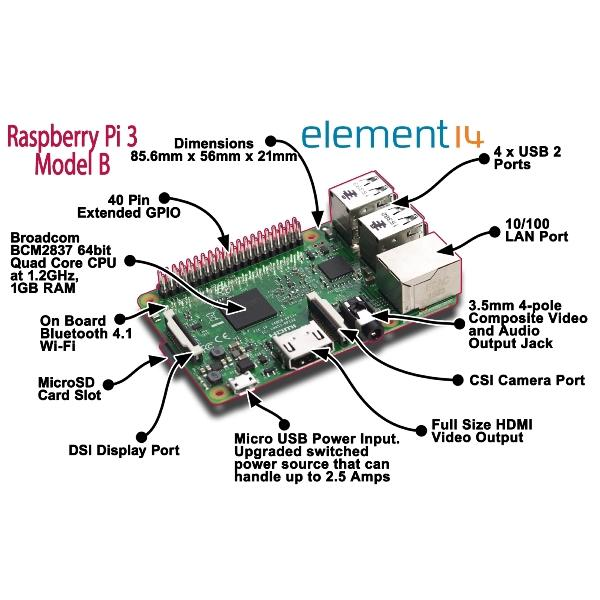
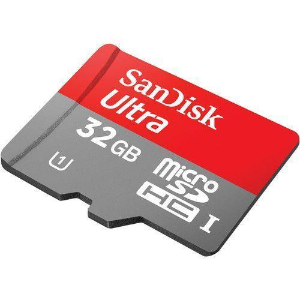
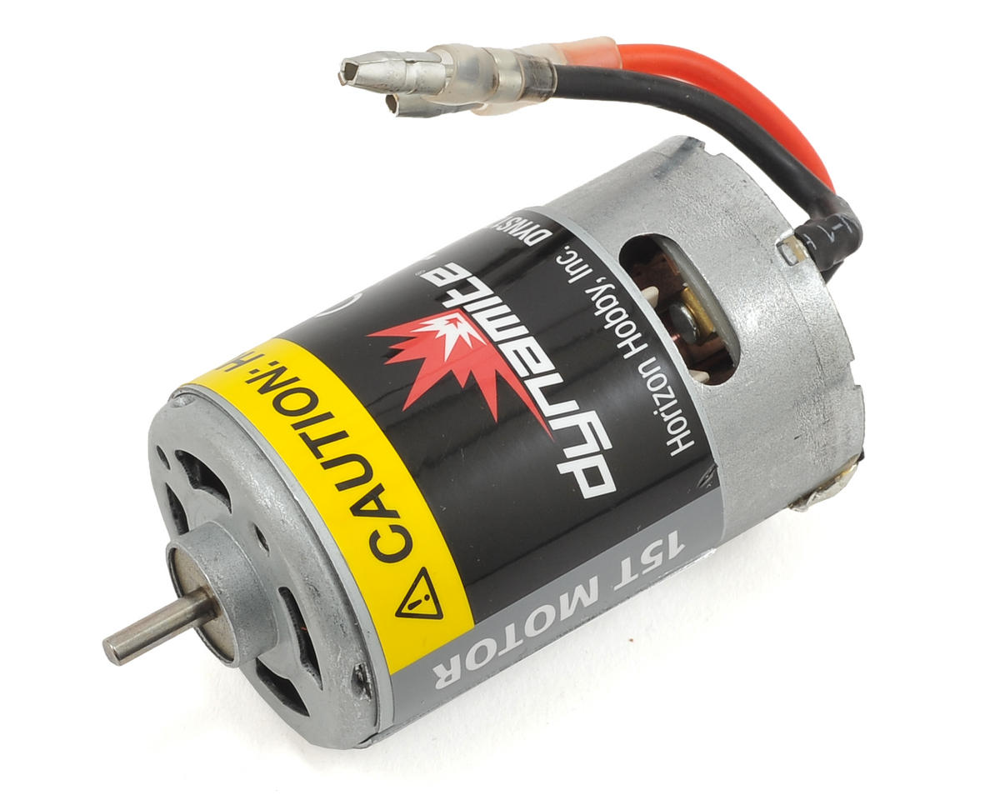
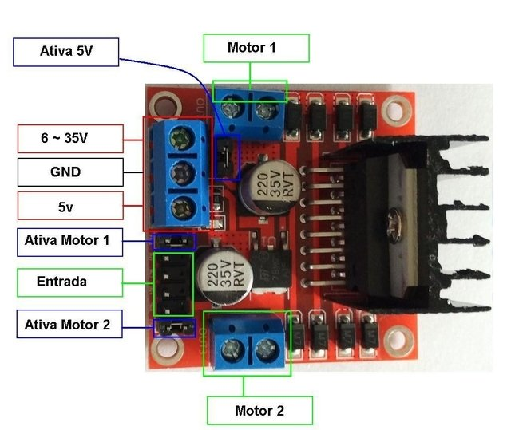
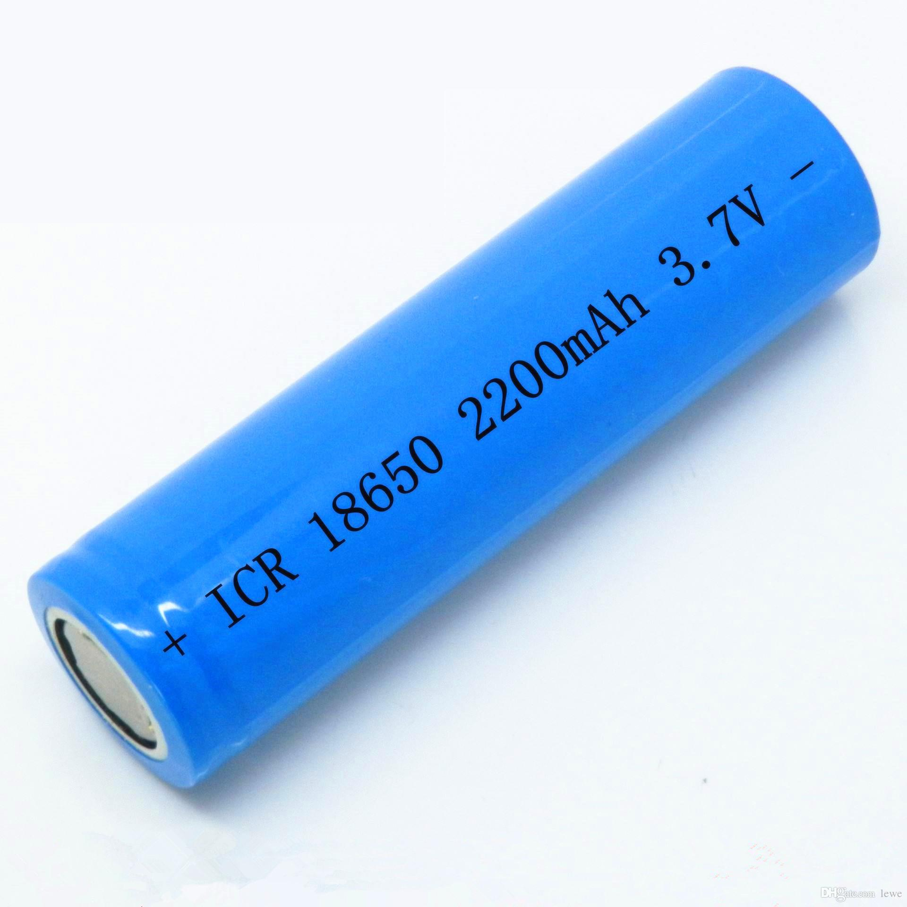
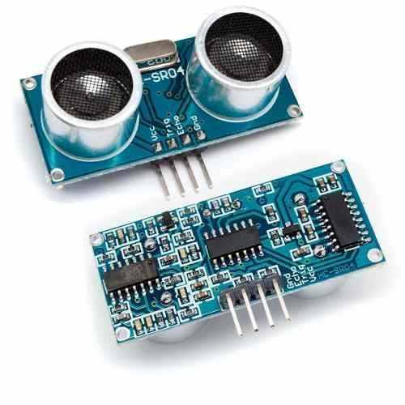
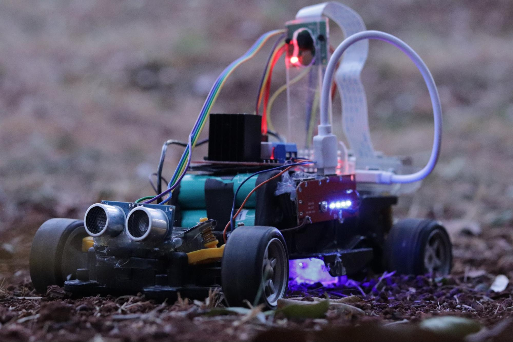
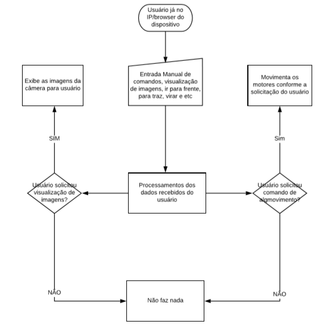
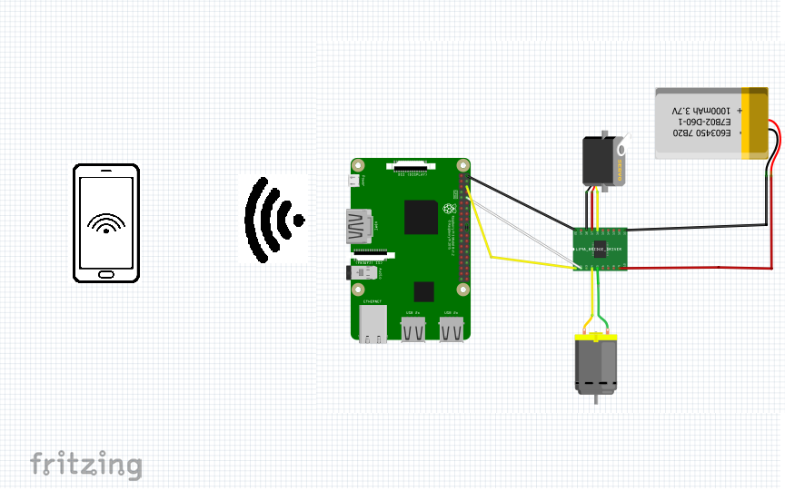

# COLÉGIO TÉCNICO DE CAMPINAS
**Gabriel Rodrigues - 17436**

## RELATÓRIO CARRO ESPIÃO

Projeto carro espião feito pelo aluno Gabriel Rodrigues do curso Técnico em Eletroeletrônica do Colégio Técnico de Campinas, apresentado no Cotuca de Portas Abertas.

Campinas, 2019

Documento em PDF disponível em: [Relatorio_TCC_Carro_Espiao.pdf](./Relatorio_TCC_Carro_Espiao.pdf)

---

## INTRODUÇÃO

### A IDÉIA

Nos últimos anos o colégio tem incentivado os alunos do curso a desenvolver projetos para colocar em prática o que aprenderam no curso, realizando uma apresentação no Cotuca de Portas Abertas, visando promover o curso e ensinar aos alunos como lidar com situações reais de apresentação de ideias ou projetos.

---

### LISTA DE MATERIAIS

| ITEM | Quantidade | PREÇO (un) | PREÇO (un) |
| :--- | :---: | :---: | :--- |
| Raspberry | 1 | R$ 199,00 | Comprado no mercado livre |
| Cartão de Memória | 1 | R$ 20,00 | Comprado no mercado livre |
| Modulo ponte H | 4 | R$ 15,90 | Comprado no mercado livre |
| Chassi(modelo de veículo) | 1 | R$ 25,00 | Retirado de um brinquedo antigo |
| Brushed Motor | 4 | R$ 17,00 | Retirado de um brinquedo antigo |
| Câmera | 1 | R$ 49,90 | Comprado no mercado livre |
| Bateria (18650) | 6 | R$ 0,00 | Retirado de baterias velhas de notebook |
| Fonte de bancada | 1 | R$ 489,00 | Comprado no mercado livre |
| **TOTAL** | | **R$ 815,80** | |

*Note que alguns dos componentes foram reaproveitados de outros dispositivos, sendo que outros poderiam ser facilmente substituídos por outros de mais baixo custo como é o caso da fonte de bancada.*

---

### Raspberry Pi

Raspberry Pi é um computador do tamanho de um cartão de crédito, que se conecta a um monitor de computador ou TV, e usa um teclado e um mouse padrão, desenvolvido no Reino Unido pela Fundação Raspberry Pi. Todo o hardware é integrado numa única placa. O principal objetivo é promover o ensino em Ciência da Computação básica em escolas.

---

### Cartão de memória

Cartão de memória ou cartão de memória flash é um dispositivo de armazenamento de dados com memória flash utilizado em consoles de videogames, câmeras digitais, telefones celulares, palms/PDAs, MP3 players, computadores e outros aparelhos eletrônicos. Em nosso projeto foi utilizado um cartão classe 10 que apresenta maior velocidade de leitura, esse cartão se fez necessário pois quanto mais rápido o cartão, menos lento será a raspberry.

---

### Brushed DC Eletric MOTOR

Um motor CC escovado é um motor elétrico comutado internamente projetado para funcionar a partir de uma fonte de energia de corrente contínua. Os motores escovados foram a primeira aplicação comercialmente importante de energia elétrica à condução de energia mecânica, e os sistemas de distribuição de corrente contínua foram usados por mais de 100 anos para operar motores em edifícios comerciais e industriais. Os motores DC escovados podem variar em velocidade, alterando a tensão de operação ou a intensidade do campo magnético. Dependendo das conexões do campo à fonte de alimentação, as características de velocidade e torque de um motor escovado podem ser alteradas para fornecer velocidade ou velocidade constante inversamente proporcional à carga mecânica. Em nosso projeto foi reaproveitado de carrinhos antigos de controle remoto que trabalham de 7V a 14V.

---

### Modulo ponte H L298

Ponte H é um circuito de eletrônica de potência do tipo chopper de classe E (um chopper de classe E converte uma fonte fixa de corrente contínua fixa em uma tensão de corrente contínua variável abrindo e fechando diversas vezes), e , portanto, pode determinar o sentido da corrente, a polaridade da tensão e a tensão em um dado sistema ou componente. Seu funcionamento dá-se pelo chaveamento de componentes eletrônicos usualmente utilizando do método de PWM para determinar além da polaridade, o módulo da tensão em um dado ponto de um circuito.Tem como principal função o controle de velocidade e sentido de motores DC escovados, podendo também ser usado para controle da saída de um gerador DC ou como inversor monofásico. O termo Ponte H, é derivado da representação gráfica típica deste circuito.

N projeto foi utilizada a ponte como um divisor de tensão pois a placa principal trabalha em 5v e os motores em 7~14V.

---

### Baterias (18650)

As células de baterias 18650 geralmente são encontradas em notebooks e lanternas no geral são feitas lítio o número 18650 remete ao tamanho delas nossas baterias tem em média 1800mA de capacidade e cada célula de bateria trabalha em 4,2V.

Outra vantagem de Bateria 18650 de Lítio (Li-Ion) deve-se ao fato de ser recarregável, o que significa dizer que poderá utilizar centenas de vezes após a recarga, economizando a compra de várias pilhas convencionais, por exemplo. Ela foi especialmente projetada para suprir a demanda de energia dos mais diversos tipos de eletrônicos e projetos, apresentando maior praticidade, economia e usabilidade.

---

### Sensor Ultrasonico

O princípio de funcionamento do HC-SR04 consiste na emissão de sinais ultrassônicos pelo sensor e na leitura do sinal de retorno (reflexo/eco) desse mesmo sinal. A distância entre o sensor e o objeto que refletiu o sinal é calculada com base no tempo entre o envio e leitura de retorno.

---

### O projeto

O Carro espião é um dispositivo com alto poder de processamento capaz de realizar várias tarefas se programado para tal, ele é equipado com uma câmera e um sensor ultrasonico, funcionando remotamente via wi-fi controlado por qualquer dispositivo com acesso a rede wifi e que tenha um navegador compatível com HTML5.

---

### Cronograma

**Março - Abril/2019**  
- Planejamento das compras a serem feitas e criação da lista dos materiais

**Maio - Junho/2019**  
- Início do desenvolvimento dos programas, montagem do chassi do carro com os componentes, testes em blocos para as funções programadas.

**Julho – Agosto/2019**  
Reestruturação do grupo do projeto, desenvolvimento das linhas de programa do controle dos motores, teste de capacidade para dimensionamento das baterias.

**Agosto - Setembro**  
- Desenvolvimento do site para controle do carro e configuração do servidor para stream de video..

**Setembro/2019**  
- Incluída programação e sensor para controle de distância de objetos, adicionado leds para auxiliar a visão da câmera durante a noite e apresentação no Cotuca de portas abertas.

**Novembro/2019**  
- Entrega do relatório.

---

### Diagramas de blocos

No diagrama de blocos ao lado podemos ver as prioridades das ações tomadas pelo Carro espião. inicialmente ele ainda não trabalha com tomada de decisões sozinho mas pode ser implementado com o tempo.

---

### Esquemas eletroeletronicos

O esquemático do dispositivo é bem simples uma vez que usamos módulos para cada função específica.

---

### Ferramentas e linguagens de programação

O projeto foi baseado na linguagem python em conjunto com a ferramenta Bootstrap.

#### Bootstrap

Bootstrap é um framework web com código-fonte aberto para desenvolvimento de componentes de interface e front-end para sites e aplicações web usando HTML, CSS e JavaScript, baseado em modelos de design para a tipografia, melhorando a experiência do usuário em um site amigável e responsivo

#### Python

Python é uma linguagem de propósito geral de alto nível, multiparadigma, suporta o paradigma orientado a objetos, imperativo, funcional e procedural. Possui tipagem dinâmica e uma de suas principais características é permitir a fácil leitura do código e exigir poucas linhas de código se comparado ao mesmo programa em outras linguagens. Devido às suas características, ela é principalmente utilizada para processamento de textos, dados científicos e criação de CGIs para páginas dinâmicas para a web. Foi considerada pelo público a 3ª linguagem "mais amada", de acordo com uma pesquisa conduzida pelo site Stack Overflow em 2018,[5] e está entre as 5 linguagens mais populares, de acordo com uma pesquisa conduzida pela RedMonk.

O nome Python teve a sua origem no grupo humorístico britânico Monty Python, criador do programa Monty Python's Flying Circus, embora muitas pessoas façam associação com o réptil do mesmo nome (em português, píton ou pitão).

---

### Organização do código

Como havia várias bibliotecas para cada função, o código foi dividido em várias partes e depois foi criado um código principal onde todas as funções são requisitadas e cada uma com sua a função.

#### Controle dos motores

Essa parte do código trabalha diretamente com a biblioteca getch, onde foi definida as teclas que iriam acionar os motores.

- Código-fonte disponível em: [control.py](./control.py)

#### Distância

Esse código foi adicionado depois que o carro já estava pronto, com a falta de noção de espaço ao se guiar pela câmera vi a necessidade de implementar algo para auxiliar no controle, esse código funciona em conjunto com o Sensor De Distância Ultrassônico Hc-sr04 e tem a função de informar ao usuário a distância até o obstáculo mais próximo.

- Código-fonte disponível em: [distancia.py](./distancia.py)

#### Servidor

Flask é a biblioteca responsável por manter um servidor da página web ativo, as instruções de uso estão na página do desenvolvedor no github https://github.com/pallets/flask

Esse mesmo código reúne e engloba as funções dos códigos acima e os encaixam num código HTML feito pelo Bootstrap.

- Código-fonte disponível em: [pibot-web.py](./pibot-web.py)
- Template da interface web disponível em: [templates/form.html](./templates/form.html)

#### Script

Por fim, para inicializar as funções todas de uma vez, esse script inicializa tanto o serviço de vídeo quanto o de controle dos motores e servidor web.

- Script de inicialização disponível em: [pibot.sh](./pibot.sh)

---

### Bibliografia e links

Saiba o que é um Raspberry pi e para que ele serve. Disponível em <https://tudosobreraspberry.info/2017/03/saiba-o-que-e-um-raspberry-pi-e-para-que-ele-serve/>. Acesso em 8 de março de 2019.

O que é um cartão de memória. Disponível em <https://pt.wikipedia.org/wiki/Cart%C3%A3o_de_mem%C3%B3ria>. acesso em 8 de março de 2019.

Brushed DC electric motor. Disponível em <https://en.wikipedia.org/wiki/Brushed_DC_electric_motor>. acesso em 8 de março de 2019.

Como estocar baterias  
<https://batteryuniversity.com/learn/> acesso em 10 de junho de 2019

Fórum de ajuda a programadores  
<http://stackoverflow.com> acesso em 10 de junho de 2019

### Fotos e vídeos do projeto disponibilizados em :

<http://abre.ai/projetoctc> acesso em 31 de outubro de 2019

